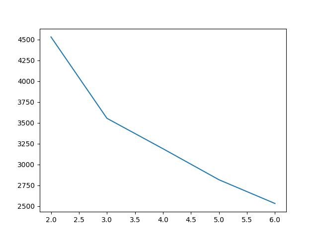
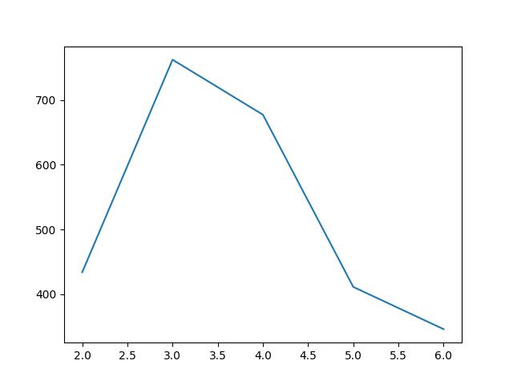

# Distributed-Assignment-1

## Members
* Utsav Basu - 20CS30057
* Anamitra Mukhopadhyay - 20CS30064
* Ritwik Ranjan Mallik - 20CS10049
* Anand Manojkumar Parikh - 20CS10007

## Testing 
Two python files can be used for testing the application. These are as follows:
1. `client.py`: It is a commandline interface to send requests to the load balancer end points.
    * `/rep`: `rep`
    * `/home`: `home`
    * `/add`: `add <count:int> [<name:string>] ...` (eg. add 5 hello \<space> world)
    * `/rm`: `del <count:int> [<name:string>] ...` (eg. del 5 hello \<space> world)
    * `/<path:path>`: `<path>` (eg. hello/world)

    Run it using:
    ``` shell
    python client.py
    ```

1. `tester.py`: It sends 10000 requests to the load balancer and saves the bar chart plot of the number of requests sent to each server in folder `./plots`.
    Run it using:
    ``` shell
    python tester.py <num:int> # num: the number of server replicas
    ```

## Analysis
The load balancer is tested for 10000 requests with 2, 3, 4, 5 and 6 server replicas. The bar chart below plots the standard deviation of the number of requests sent to each server.

#### With Given Hash Function:


#### With Modified Hash Function:


#### With Cryptographic Hash Function:


## Main Libraries Used
### [Quart](https://pgjones.gitlab.io/quart/)
There are two major specifications for interfacing web applications with web servers: [WSGI (Web Server Gateway Interface)](https://wsgi.readthedocs.io/en/latest/what.html) and [ASGI (Asynchronous Server Gateway Interface)](https://asgi.readthedocs.io/en/latest/). WSGI is a synchronous interface, meaning that it handles one request at a time per process or thread. On the other hand, ASGI supports handling multiple requests concurrently without blocking. Since the load balancer should be able to handle as many as 10,000 concurrent requests, an web application based on WSGI such as [Flask](https://flask.palletsprojects.com/en/3.0.x/) is not suitable. Rather, Quart, a framework built on top of Flask supporting ASGI servers is a better choice.

### [asyncio](https://docs.python.org/3/library/asyncio.html)
In python, asyncio is a library to write concurrent code using async/await syntax. Many asynchronous python frameworks that provide high-performance network and web-servers, database connection libraries, distributed task queues etc. are built on top of asyncio.

### [aiohttp](https://docs.aiohttp.org/en/stable/)
The aiohttp library is used for bulilding asynchronous HTTP client/server for asyncio and Python. It supports both Server WebSockets and Client WebSockets. 

### [aiodocker](https://aiodocker.readthedocs.io/en/latest/)
The aiodocker library is a simple docker HTTP API wrapper written with asyncio and aiohttp. Rather than making system calls inside the load balancer to perform docker related tasking like adding or removing server containers, aiodocker exposes functions with loads of flexibilities to perform these tasks.

### [fifolock](https://github.com/michalc/fifolock)
This library is used for controlling concurrent read/writes to two important data structures used in the application. One of these data structures is used for mapping requests to virtual servers by consistent hasing. The other maintains the count of failed heartbeats for the servers.  

## Design Choices
Different design choices have been made throughout the application, keeping in mind efficiency, functionality and understandability. Some of these are given below:

### Threading vs Asyncio
Both threading and asyncio libraries in Python support concurrent programming. However, choice was made to use the asyncio library due to the following reasons:
1. Due to the Global Interpreter Lock, only one thread can execute Python code at once. This means that for most Python 3 implementations, the different threads do not actually execute at the same time, they merely appear to.
1. Threads are used to perform preemptive multi-tasking where the scheduler decides which threads to run and when. On the other hand, asyncio model allows cooperative multi-tasking where the user decides which tasks to run and when.

### Random Hostnames
When a GET request is made to the /add endpoint of the load balancer, the payload requires the number of servers `N` and list of hostnames `replicas`. If `N` > `len(replicas)`, `N - len(replicas)` servers are to be added having random hostnames. A random hostname has the format `Server-XXX-YYY` where XXX is a three-digit random number and YYY is a three-digit timestamp based on the current time in milliseconds. The chances of two randomly generated hostnames having the same hostname, in practice, is quite low. Even then, this case is handled by using a set so that no two generated hostnames are the same.

### Cooperative Multitasking
The application runs several taks asynchronously. These are:
1. `spawn_container`: This task is used to spawn the server containers. The load balancer maintains a total of `N` servers at a time. If some server goes down, the load balancer detects it and spawns a new server.
1. `remove_container`: This task is used to remove the spawned server containers. The load balancer sends a signal SIGINT to the running container to stop it. If the container does not stop within `STOP_TIMEOUT`, it sends a SIGKILL signal to remove the container altogether. 
1. `get_heartbeat`: This task is used to periodically get the heartbeats of the server containers. Whenever a new server container is added, an entry is initialized as 0. This maintains the number of failed heartbeats for that container. The load balancer checks the heartbeats at an interval of `HEARTBEAT_INTERVAL` seconds. Upon not receiving the heartbeat for a server, the corresponding entry is increased. When this entry reaches `MAX_FAIL_COUNT`, the server is assumed to be down and is restarted. This task is run as background task using Quart.
1. `handle_flatline`: This task is used to handle the flatline of the servers. When a server becomes unresponsive and is assumed to be down, this task respawns a new server. This new server replaces the failed server. 

A cooperation takes place whenever there are multiple tasks to perform simultaneously. For docker related tasks such as spawning and removing a container, the set of tasks are added to to a pool and processed in batches of size `DOCKER_TASK_BATCH_SIZE`. This is done using a semaphore initialized to `DOCKER_TASK_BATCH_SIZE`. For http requests, similarly, the set of requests are processed in batches of size `REQUEST_BATCH_SIZE`. This is done using a semaphore initialized to `REQUEST_BATCH_SIZE`. Cooperation is ensured by calling `await asyncio.sleep(0)` inside a task in appropiate places, which gives other tasks a chance to run before it itself starts executing.

### Dockerfile
Some design choices have been made during dockerizing the application. These are as follows:
1. The default python image is based on the Ubuntu image which installs some unnecessary packages not needed for our application. Instead, the python image based on the Alpine image is used. This image is much lighter than the earlier one.
1. Multistage build have been used during dockerization. This is done to reduce the image sizes for the load balancer and the server as much as possible.
